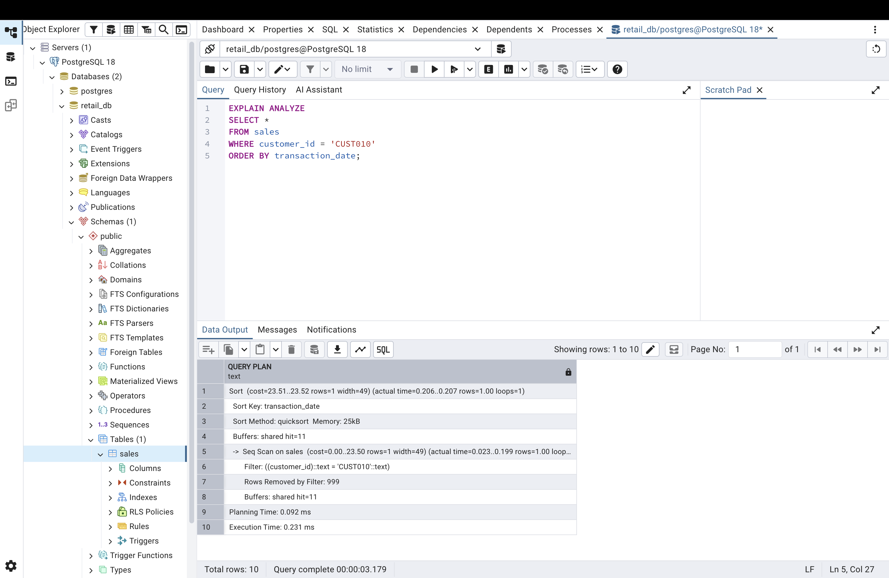
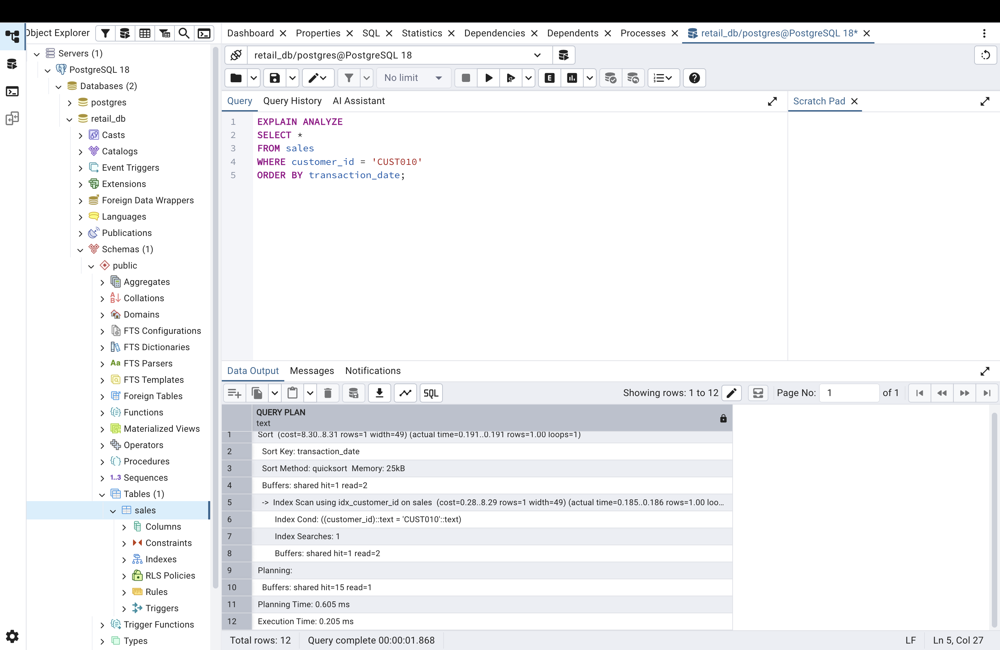

# Retail Database System

A PostgreSQL-based retail database project built using a Kaggle retail sales dataset. This project demonstrates core database administration and SQL skills, including data ingestion, user and role management, backup and restore testing, monitoring, query optimisation, and table partitioning.

## Overview

This project simulates the setup and administration of a retail transaction database for a small business environment. The system was designed to support realistic retail use cases such as transaction analysis, customer lookup, backup scheduling, and performance tuning.

Key features implemented in this project include:

- creation of a structured PostgreSQL sales table from a CSV dataset
- secure access control using users, roles, and least-privilege permissions
- automated logical backups using a shell script
- restore testing to validate backup reliability
- monitoring of database activity and storage usage
- query optimisation using `EXPLAIN ANALYZE` and indexing
- range partitioning by transaction date for scalability and data management

## Dataset and Schema

The dataset used in this project is a retail sales dataset obtained from Kaggle. It contains transactional data representing customer purchases across different product categories.

### Dataset features

Each record in the dataset includes:

- `transaction_id`: unique identifier for each transaction  
- `transaction_date`: date of purchase  
- `customer_id`: unique customer identifier (alphanumeric)  
- `gender`: customer gender  
- `age`: customer age  
- `product_category`: category of the purchased product  
- `quantity`: number of items purchased  
- `price_per_unit`: price of a single unit  
- `total_amount`: total transaction value  

### Schema design

A relational table named `sales` was created in PostgreSQL to store the dataset. The schema was designed to reflect the structure of the data while ensuring appropriate data types for each column.

```sql
CREATE TABLE sales (
    transaction_id INT PRIMARY KEY,
    transaction_date DATE,
    customer_id VARCHAR(20),
    gender VARCHAR(10),
    age INT,
    product_category VARCHAR(100),
    quantity INT,
    price_per_unit NUMERIC(10,2),
    total_amount NUMERIC(10,2)
);
```

### Data type considerations

During data ingestion, a schema mismatch was identified: the `customer_id` field was initially defined as an integer, while the dataset contained alphanumeric values (e.g. 'CUST001'). This was corrected by changing the column type to `VARCHAR`, ensuring compatibility with the source data.

This highlights the importance of aligning database schemas with real-world data formats during ingestion.

## Data Ingestion and Setup

The dataset was imported into PostgreSQL from a CSV file using both graphical tools and command-line utilities.

### Table creation

The `sales` table was created using the schema defined in `schema.sql`.

### Data import

The dataset was loaded from a cleaned CSV file containing retail transaction data. The import process required careful alignment between the CSV structure and the database schema, including:

- matching column names exactly  
- ensuring correct data types (e.g. text vs numeric fields)  
- handling date formats compatible with PostgreSQL  

Data was successfully loaded into the `sales` table and verified using simple validation queries:

```sql
SELECT COUNT(*) FROM sales;
SELECT * FROM sales LIMIT 5;
```
### Verification

After ingestion, the dataset was validated to ensure:

- all rows were successfully imported
- no data was truncated or misaligned
- values appeared consistent across columns

This step ensured that the database was correctly initialised before proceeding with further operations such as querying, optimisation, and partitioning.

## Security and User Management

Basic access control was implemented to simulate a production-like environment with controlled user permissions.

### User and role setup

A dedicated user (`analyst`) was created for read-only access, along with a role (`read_only`) to enforce least-privilege principles.

```sql
CREATE USER analyst WITH PASSWORD 'secure123';

CREATE ROLE read_only;

GRANT CONNECT ON DATABASE retail_db TO read_only;
GRANT USAGE ON SCHEMA public TO read_only;
GRANT SELECT ON ALL TABLES IN SCHEMA public TO read_only;

GRANT read_only TO analyst;
```

### Access control

The `analyst` user was restricted to read-only operations, ensuring that:

- data can be queried but not modified
- accidental or unauthorised changes are prevented
- responsibilities can be separated between users

### Validation

Permissions were tested by attempting restricted operations (e.g. `INSERT`, `DELETE`) using the analyst account, which correctly resulted in permission errors.

### Notes

The password used in this project is for demonstration purposes only. In a production environment, secure credential management and stronger authentication mechanisms would be required.

## Backup and Recovery

A backup and recovery strategy was implemented to ensure data reliability and simulate real-world database administration practices.

### Backup strategy

Logical backups were created using PostgreSQL’s `pg_dump` utility. A shell script was developed to automate the backup process and generate timestamped SQL dump files.

```bash
#!/bin/bash

DB_NAME="retail_db"
BACKUP_DIR="./db_backups"
DATE=$(date +%F)

mkdir -p "$BACKUP_DIR"

pg_dump -d "$DB_NAME" -U postgres > "$BACKUP_DIR/${DB_NAME}_$DATE.sql"

echo "Backup completed: $BACKUP_DIR/${DB_NAME}_$DATE.sql"
```

This script creates a new backup file for each execution, allowing multiple recovery points to be maintained.

### Restore testing

To validate the reliability of the backup process, a full restore test was performed:

1. a new database (`retail_db_restore_test`) was created
2. the backup file was restored using the psql command
3. data integrity was verified using row counts and sample queries

```sql
SELECT COUNT(*) FROM sales;
```

The restored database contained the expected number of rows, confirming that the backup process was successful.

### Observations

This process demonstrates that a backup is only meaningful if it can be successfully restored. Validation of recovery procedures is a critical step in database administration.

### Notes

In a production environment, additional considerations would include:

- secure storage of backup files
- backup scheduling (e.g. daily or weekly)
- retention policies for old backups
- potential use of incremental backups or point-in-time recovery (PITR)

### Automation

In a production environment, the backup script would typically be scheduled using a job scheduler such as `cron` (on Unix-based systems). This allows backups to run automatically at defined intervals (e.g. daily or weekly) without manual intervention.

For example, the backup script could be scheduled to run during off-peak hours to minimise impact on system performance.

## Monitoring and Performance

Basic monitoring techniques were used to inspect database activity and resource usage.

### Database activity

PostgreSQL system views were used to monitor active sessions and queries:

```sql
SELECT pid, usename, state, query
FROM pg_stat_activity;
```

This allows visibility into:

- active connections
- currently running queries
- idle sessions

### Storage monitoring 

Database size was inspected using built-in PostgreSQL functions:

```sql
SELECT pg_size_pretty(pg_database_size('retail_db'));
```

This provides a human-readable representation of database storage usage.

### Table-level insights

Table storage statistics were analysed using PostgreSQL system catalog views:

```sql
SELECT relname AS table_name,
       pg_size_pretty(pg_total_relation_size(relid)) AS size
FROM pg_catalog.pg_statio_user_tables;
```

This helps identify which tables consume the most storage.

### Observations

These monitoring tools provide insight into database usage and performance characteristics. While the dataset in this project is relatively small, the same techniques scale to production environments where monitoring is critical for detecting performance issues and managing system resources.

### PostgreSQL maintenance considerations

PostgreSQL uses a Multi-Version Concurrency Control (MVCC) model, which means that updates and deletes do not immediately remove old rows. Instead, they create "dead tuples" that remain in the database until cleaned up.

Over time, the accumulation of dead tuples can:

- increase table size (bloat)  
- degrade query performance  
- impact storage efficiency  

To address this, PostgreSQL uses the `VACUUM` process to reclaim storage and maintain performance:

```sql
VACUUM ANALYZE sales;
```

- `VACUUM` removes dead tuples and frees space
- `ANALYZE` updates statistics used by the query planner

In production environments, this process is typically handled automatically by PostgreSQL’s `autovacuum` system, ensuring ongoing maintenance without manual intervention.

## Query Optimisation

Query performance was analysed using PostgreSQL’s `EXPLAIN ANALYZE` to understand how the database executes queries and to identify opportunities for optimisation.

### Query analysed

A query retrieving customer purchase history was selected as a realistic use case:

```sql
SELECT *
FROM sales
WHERE customer_id = 'CUST010'
ORDER BY transaction_date;
```

### Before indexing



The query plan shows that PostgreSQL performs a **Sequential Scan** on the `sales` table.

- the entire table is scanned row by row  
- 999 rows are removed by the filter to retrieve a single match  
- this approach becomes inefficient as dataset size increases

### After indexing



After indexing, the query plan changes to an **Index Scan**.

- PostgreSQL directly locates matching rows using the index  
- full table scanning is avoided  
- this significantly improves efficiency for large datasets

### Observations

Although the execution time difference is minimal for this dataset, the change in query plan demonstrates how indexing improves performance at scale.

This highlights the importance of indexing frequently queried columns, particularly in lookup and filtering operations.

## Table Partitioning

To simulate a scalable production design, the `sales` table was partitioned by transaction date using PostgreSQL range partitioning.

### Partitioned table design

A new partitioned table was created with the same structure as the original `sales` table:

```sql
CREATE TABLE sales_partitioned (
    transaction_id INT,
    transaction_date DATE,
    customer_id VARCHAR(20),
    gender VARCHAR(10),
    age INT,
    product_category VARCHAR(100),
    quantity INT,
    price_per_unit NUMERIC(10,2),
    total_amount NUMERIC(10,2)
)
PARTITION BY RANGE (transaction_date);
```

### Partition creation 

Separate partitions were created for different date ranges:

```sql
CREATE TABLE sales_2023 PARTITION OF sales_partitioned
FOR VALUES FROM ('2023-01-01') TO ('2024-01-01');

CREATE TABLE sales_2024 PARTITION OF sales_partitioned
FOR VALUES FROM ('2024-01-01') TO ('2025-01-01');
```

### Data migration 

Existing data from the `sales` table was inserted into the partitioned table:

```sql
INSERT INTO sales_partitioned
SELECT * FROM sales;
```

The data was successfully distributed across partitions, and the total row count was verified:

```sql
SELECT COUNT(*) FROM sales_partitioned;
```

### Observations

During implementation, a partitioning constraint error was encountered due to PostgreSQL’s handling of range boundaries:

- the lower bound is inclusive
- the upper bound is exclusive

This required the creation of an additional partition to accommodate data with a boundary value (`2024-01-01`).

### Benefits 

Partitioning improves performance and manageability for large datasets by:

- reducing the amount of data scanned for date-based queries
- enabling partition pruning by the query planner
- simplifying data archiving and maintenance

Although the dataset in this project is relatively small, this design reflects how time-based partitioning is commonly used in production systems.

## Future Improvements

This project demonstrates core database administration and SQL concepts in a controlled environment. In a production setting, several additional features and improvements could be implemented.

### Automation and scheduling

- schedule automated backups using tools such as `cron`  
- implement logging for backup execution and failures  
- trigger alerts in case of unsuccessful backup operations  

### Security and auditing

- enable audit logging to track user activity and access patterns  
- enforce stronger authentication and credential management  
- implement encryption for data at rest and in transit  

### Backup and recovery enhancements

- implement incremental backups or point-in-time recovery (PITR)  
- define backup retention policies  
- store backups securely in external or cloud-based storage  

### Monitoring and alerting

- monitor long-running queries and system load  
- configure alerts for abnormal activity or performance degradation  
- track database growth over time  

### Performance and scalability

- expand partitioning strategy across multiple years of data  
- evaluate additional indexing strategies for complex queries  
- tune PostgreSQL configuration parameters for memory and parallelism  

### Version control and testing

- integrate database scripts into version control workflows  
- implement automated validation checks for data ingestion and restoration  
- add testing procedures to ensure consistency across environments  
